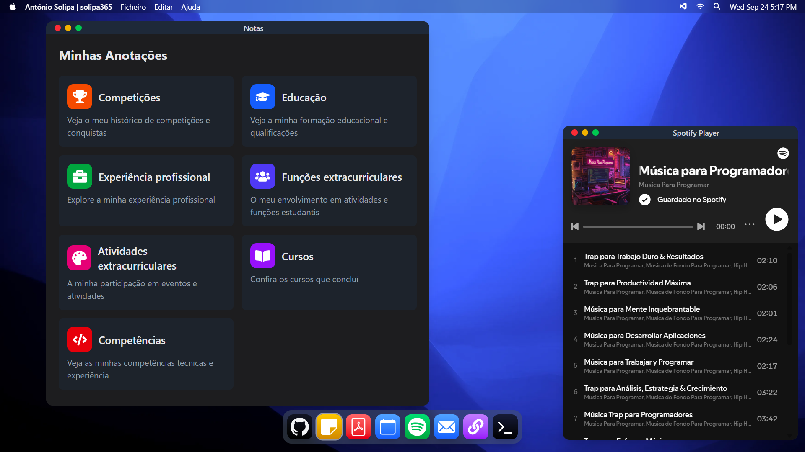

# Portfólio de António Solipa (solipa365)

 

<br>

### Portfólio amigável ao Usuário do MacOS

Um site de portfólio moderno e interativo criado com Astro, React e Tailwind CSS, com uma interface inspirada no MacOS.

## 🚀 Recursos

- **Pilha de Tecnologia Moderna**: Construído com Astro, React e Tailwind CSS
- **Interface de Terminal**: IU inspirada em terminal macOS que integra um chatbot para uma experiência única do usuário
- **Dados do usuário facilmente personalizáveis**: O usuário pode criar sua própria versão editando os dados no arquivo `userconfig.ts`.
- **Resumo dos Projetos**: O usuário pode adicionar todos os seus projetos para uma prévia da estrutura do projeto, além de capturas de tela e links do GitHub.
- **Aplicativo de Notas**: O usuário pode adicionar todos os seus dados relacionados de forma intuitiva e narrativa.
- **Design Responsivo**: Layout totalmente responsivo que funciona em todos os dispositivos
- **Otimizado para SEO**: Geração de sitemap e ferramentas de SEO integradas
- **Suporte a TypeScript**: Integração completa com TypeScript para uma melhor experiência de desenvolvimento
- **Implantação Vercel**: Otimizado para implantação no Vercel

## 🛠️ Pilha de Tecnologia

- [GitHub](https://github.com/) - Plataforma de hospedagem
- [Vercel](https://vercel.com/) - Plataforma de implantação
- [Astro](https://astro.build/) - Construtor de sites estáticos moderno
- [React](https://reactjs.org/) - Biblioteca de componentes de interface do usuário
- [TypeScript](https://www.typescriptlang.org/) - JavaScript com tipagem segura
- [Tailwind CSS](https://tailwindcss.com/) - Framework CSS que prioriza utilitários

## 📦 Instalação

1. Clone o repositório:
```bash
git clone https://github.com/solipa365/portfolio/
cd portfolio
```

2. Instale dependências:
```bash
npm install
```

3. Crie um arquivo `.env` no diretório raiz e adicione suas variáveis ​​de ambiente:
```env
GROQ_API_KEY = YOUR_GROQ_API_KEY
```

4. Acesse o arquivo `userconfig.ts` e comece a inserir seus dados.

5. Para gerar arquivos json para seus projetos, forneci um arquivo `github_repo_parser.py` na pasta `util`, você pode fornecer um token github para evitar a limitação de taxa para a chamada do analisador no principal
```python
def main():
    parser = GitHubRepoParser('ghp_YOUR_TOKEN_HERE')
    
```

## 🚀 Desenvolvimento

Para iniciar o servidor de desenvolvimento:

```bash
npm run dev
```

Isso iniciará o servidor de desenvolvimento em `http://localhost:4321`.

## 🏗️ Construindo para Produção

Para construir o projeto para produção:

```bash
npm run build
```

Para visualizar a compilação de produção:

```bash
npm run preview
```

## Implantar no Vercel:
```bash
npx vercel deploy --prod
```
ou
```bash
npx vercel deploy
```
e selecione a imagem no painel do Vercel.

Há um bug com a implantação direta do GitHub. Ainda não consigo descobrir, então, por enquanto, use os comandos acima após executar ```npm run build```.

## 📁 Estrutura do Projeto

```
├── src/
│   ├── components/     # React components
│   ├── layouts/        # Layout components
│   ├── pages/          # Astro pages
│   ├── styles/         # Global styles
│   ├── config/         # Configuration files
│   └── assets/         # Static assets
├── public/             # Public assets
├── .astro/             # Astro build files
├── util/               # Utility functions
└── astro.config.mjs    # Astro configuration
```

## 🔧 Configuração

O projeto é configurado por meio de vários arquivos-chave:

- `astro.config.mjs`: Configuração principal do Astro
- `tsconfig.json`: Configuração TypeScript
- `tailwind.config.js`: Configuração CSS do Tailwind

## 🚀 Implantação

O projeto está configurado para implantação no Vercel. Para implantar:

1. Envie suas alterações para o seu repositório do GitHub
2. Conecte seu repositório ao Vercel
3. O Vercel implantará seu site automaticamente

## 📝 Licença

Este projeto está licenciado sob a Licença MIT - consulte o arquivo LICENSE para obter detalhes.

## 🙏 Agradecimentos

- Inspirado na interface do terminal do MacOS
- Construído com tecnologias web modernas
- Obrigado a todos os colaboradores e mantenedores das ferramentas de código aberto utilizadas neste projeto
